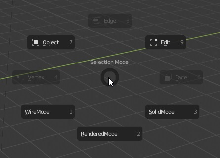
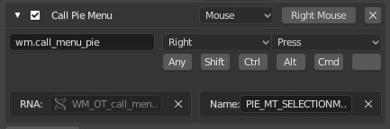
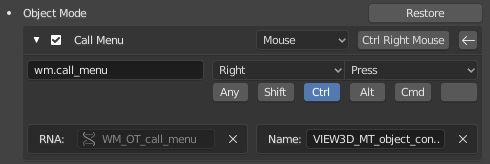

# Blender2.8 Selection Mode Menu
This pie menu allows for quick access to basic functions through the pie menu. Switching from **Object** to **Edit** mode is as simple as opening the menu and choosing whichever selection mode you wish to use. The plugin also allows for easy switching between **wireframe, solid** and **rendered** modes.

## Installing the menu
1. Open Blender2.8 settings
1. Go to Addons > Install
1. Select **sr_selectionModePie.py** and enable the Addon
1. Go into your keybmap settings and under 3D View > 3D View Global, scroll down and click "Add New"
1. In the first text box type `wm.call_menu_pie` and press enter, then pasting in `PIE_MT_SELECTIONMODE` in the name section.
1. You can set your keybind to be whatever you like; I set mine to be the right mouse button so that it is similar to Maya

    1. For easy access to the menu I'd suggest setting this to right click then setting the context menu to be ctrl + right click. There are two instances of this menu, one under object bindings and the other under mesh bindings. Also disable the extrude to cursor bindings. 
    
    